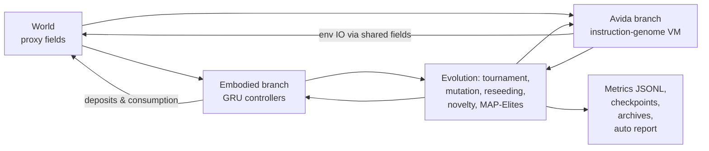

# Hybrid Artificial-Life Simulator

A research-oriented JAX artificial-life system that pairs **embodied recurrent neural
agents** with **Avida-inspired digital organisms** in a shared 2D world whose sensory
ecology is built from microfluidics-inspired proxy fields (Dean-flow curvature, shear,
shear gradient, inertial-lift proxy, margination/enrichment, and diffusing concentration
waves). All "physics" is proxy: no CFD solver, no wet lab; the goal is to create
structured, partially-observable sensory pressure for open-ended evolution.

## Architecture



Branches share a single `WorldState` containing:

- `terrain` `[H, W, 4]` (bias, ridge, basin, channel-mask)
- `resources`, `hazards` `[H, W, R]/[H, W, Z]`
- `flow`, `shear`, `shear_grad`, `lift`, `enrichment` (sixth-sense channels)
- `curvature`, `concentration`, `metabolites`
- `occupancy` and `time`

The six sixth-sense modalities are sampled at each agent's grid cell with optional
Gaussian noise, blind/shuffle/no-sixth-sense ablations, and a "crowding context" channel
that uses occupancy and neighbor message energy.

## Quick start

```bash
python -m venv .venv
source .venv/bin/activate
pip install -e ".[dev]"

# Run the short base smoke (2 generations).
python scripts/run_sim.py --config configs/base.yaml

# Run the 200-generation smoke and produce a report.
python scripts/run_sim.py --config configs/smoke200.yaml
python scripts/generate_report.py outputs/runs/smoke200

# Run a specific ablation.
python scripts/run_sim.py --config configs/ablation_blind.yaml
```

## Repo layout

```text
src/hybrid_alife/
  agents/       embodied recurrent agents and Avida-style VM organisms
  world/        shared 2D substrate, fields, sixth-sense sampling
  evolution/    selection, reseeding, novelty & MAP-Elites archives
  experiments/  experiment runner, config loader
  logging/      JSONL metric writer
  metrics/      survival, diversity, communication, enrichment metrics
  replay/       deterministic pickle checkpoints
  viz/          matplotlib plotting helpers
configs/        YAML experiment configs (base, smoke200, six ablations)
experiments/    named experiment plans
notebooks/      exploratory analysis
tests/          CPU-feasible smoke tests
scripts/        CLI entrypoints (run_sim, generate_report)
outputs/        runtime outputs (gitignored)
.github/        CI workflow
```

## Configs available

| Config | Purpose |
|---|---|
| `base.yaml` | Default short smoke (2 generations, 8 steps each) |
| `smoke200.yaml` | 200-generation smoke run with MAP-Elites + novelty archive |
| `ablation_blind.yaml` | Zero-out all observation patches and sixth-sense channels |
| `ablation_true_sixth_sense.yaml` | All six modalities enabled (control) |
| `ablation_shuffled_sixth_sense.yaml` | Sixth-sense channels randomly permuted each step |
| `ablation_no_memory.yaml` | GRU recurrence disabled (MLP) |
| `ablation_no_comms.yaml` | Message channel zeroed |
| `ablation_static_world.yaml` | No drift, no flow noise |
| `ablation_drifting_world.yaml` | Drifting flow field, higher noise |

## Current results (200-generation smoke run)

Outputs land in `outputs/runs/<run_name>/`:

- `metrics.jsonl` — per-step metrics
- `checkpoint_gen*.pkl` — deterministic checkpoints
- `novelty_archive.npz`, `map_elites.npz` — archive snapshots
- `config.yaml`, `report.md`, `plots/*.png` — auto report

On a recent CPU run of `smoke200.yaml` (200 generations, 4 steps each, pop=10):

- 200 records written, run wall-clock ~110 s
- embodied alive fraction stable at 1.0 (reseeding keeps population healthy)
- average action entropy ≈ 1.60 (out of ~2.30 max), suggesting diverse behavior
- coordinated-behavior-index averaging 0.70 (strong shared action distributions)
- Avida mean merit climbs from ~1.0 to ~7.5 (replicators accumulate useful work)
- MAP-Elites coverage ≈ 0.11 (sparse but non-zero behavioral diversity)

See `outputs/runs/smoke200/report.md` for the auto-generated report and plots.

## Metrics implemented

- Survival fraction (per branch)
- Lineage depth: mean and max
- Reproductive success (unique living lineages)
- Action entropy (behavioral diversity proxy)
- Communication usage rate, message energy
- Coordinated behavior index (convention/ritual proxy)
- Enrichment separation index (microfluidic-separation analog)
- Mean Avida merit (useful work proxy)
- World aggregate stats (mean enrichment, concentration, metabolite)

## Tests

```bash
pytest -q
```

The smoke suite covers world init, embodied actions on every path, GRU controller,
reproduction into dead slots, Avida self-replication, all VM ops, tournament
selection, extinction recovery, novelty and MAP-Elites archives, metrics, JSONL
roundtrip, checkpoint roundtrip, and full end-to-end run.

## Roadmap

Implemented in this milestone:

- Full proxy-physics world with six sixth-sense modalities, drift/noise options
- Embodied GRU controller with all action types coupled to world deposits and resource consumption
- Avida-style VM with seeded self-replicator, H_ALLOC/H_COPY/H_DIVIDE, point/insertion/deletion mutation
- Tournament selection, extinction reseeding, novelty + MAP-Elites archives
- JSONL metrics, deterministic checkpoints, auto report generation
- Six ablation configs, CI workflow, comprehensive smoke tests

Partial / next steps:

- Lineage depth/reproduction counters: currently lineage IDs grow but inter-generation propagation needs deeper validation against branching trees.
- Transfer/robustness experiments: configs exist for static/drifting ablation but cross-environment transfer runs are not yet automated.
- Flax-based controllers: current GRU is hand-rolled JAX; a Flax variant would simplify scaling.
- Faster JIT step: `step_sim` is not yet `jit`-wrapped because of the dataclass orchestration; the numeric kernels are already JAX-vectorized.

## Limitations

- This is research scaffolding, not a CFD simulator. Proxy fields are stylized.
- Tests and runs are deliberately small (CPU-feasible) so CI stays fast.
- Reproduction uses simple greedy slot-matching; there is no genealogy database.
- "Six senses" is a labeled grouping for clarity, not a biological claim.

## Development

```bash
pip install -e ".[dev]"
ruff check src tests
pytest -q
```

CI runs the same on push.
