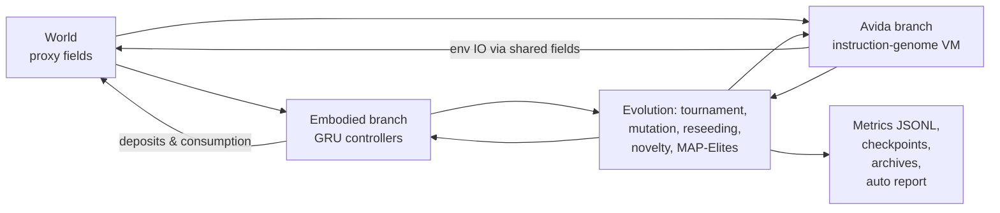

# Hybrid Artificial-Life Simulator

A research-oriented JAX artificial-life system that pairs **embodied recurrent neural
agents** with **Avida-inspired digital organisms** in a shared 2D world whose sensory
ecology is built from microfluidics-inspired proxy fields (Dean-flow curvature, shear,
shear gradient, inertial-lift proxy, margination/enrichment, and diffusing concentration
waves). All "physics" is proxy: no CFD solver, no wet lab; the goal is to create
structured, partially-observable sensory pressure for open-ended evolution.

## Architecture



Branches share a single `WorldState` containing:

- `terrain` `[H, W, 4]` (bias, ridge, basin, channel-mask)
- `resources`, `hazards` `[H, W, R]/[H, W, Z]`
- `flow`, `shear`, `shear_grad`, `lift`, `enrichment` (sixth-sense channels)
- `curvature`, `concentration`, `metabolites`
- `occupancy` and `time`

The six sixth-sense modalities are sampled at each agent's grid cell with optional
Gaussian noise, blind/shuffle/no-sixth-sense ablations, and a "crowding context" channel
that uses occupancy and neighbor message energy.

## Quick start

```bash
python -m venv .venv
source .venv/bin/activate
pip install -e ".[dev]"

# Run the short base smoke (2 generations).
python scripts/run_sim.py --config configs/base.yaml

# Run the 200-generation smoke and produce a report.
python scripts/run_sim.py --config configs/smoke200.yaml
python scripts/generate_report.py outputs/runs/smoke200

# Run a specific ablation.
python scripts/run_sim.py --config configs/ablation_blind.yaml
```

## Repo layout

```text
src/hybrid_alife/
  agents/       embodied recurrent agents and Avida-style VM organisms
  world/        shared 2D substrate, fields, sixth-sense sampling
  evolution/    selection, reseeding, novelty & MAP-Elites archives
  experiments/  experiment runner, config loader
  logging/      JSONL metric writer
  metrics/      survival, diversity, communication, enrichment metrics
  replay/       deterministic pickle checkpoints
  viz/          matplotlib plotting helpers
configs/        YAML experiment configs (base, smoke200, six ablations)
experiments/    named experiment plans
notebooks/      exploratory analysis
tests/          CPU-feasible smoke tests
scripts/        CLI entrypoints (run_sim, generate_report)
outputs/        runtime outputs (gitignored)
.github/        CI workflow
```

## Configs available

| Config | Purpose |
|---|---|
| `base.yaml` | Default short smoke (2 generations, 8 steps each) |
| `smoke200.yaml` | 200-generation smoke run with MAP-Elites + novelty archive |
| `ablation_blind.yaml` | Zero-out all observation patches and sixth-sense channels |
| `ablation_true_sixth_sense.yaml` | All six modalities enabled (control) |
| `ablation_shuffled_sixth_sense.yaml` | Sixth-sense channels randomly permuted each step |
| `ablation_no_memory.yaml` | GRU recurrence disabled (MLP) |
| `ablation_no_comms.yaml` | Message channel zeroed |
| `ablation_static_world.yaml` | No drift, no flow noise |
| `ablation_drifting_world.yaml` | Drifting flow field, higher noise |

## Current results (200-generation smoke run)

Outputs land in `outputs/runs/<run_name>/`:

- `metrics.jsonl` — per-step metrics
- `checkpoint_gen*.pkl` — deterministic checkpoints
- `novelty_archive.npz`, `map_elites.npz` — archive snapshots
- `config.yaml`, `report.md`, `plots/*.png` — auto report

On a recent CPU run of `smoke200.yaml` (200 generations, 4 steps each, pop=10):

- 200 records written, run wall-clock ~110 s
- embodied alive fraction stable at 1.0 (reseeding keeps population healthy)
- average action entropy ≈ 1.60 (out of ~2.30 max), suggesting diverse behavior
- coordinated-behavior-index averaging 0.70 (strong shared action distributions)
- Avida mean merit climbs from ~1.0 to ~7.5 (replicators accumulate useful work)
- MAP-Elites coverage ≈ 0.11 (sparse but non-zero behavioral diversity)

See `outputs/runs/smoke200/report.md` for the auto-generated report and plots.

### Reporting

- `scripts/generate_report.py <run_dir>` — auto-generated markdown report.
  Gracefully consumes any subset of `metrics.jsonl`, `scaling_slopes.json`,
  `transfer_matrix.json`, `map_elites.npz`, `novelty_archive.npz`, and
  `checkpoint_final.pkl`.
- Useful flags:
  - `--no-plots` — skip plot generation (CI-friendly, no matplotlib)
  - `--headline` — emit only the headline-metrics table (sweep aggregation)
  - `--baseline <run_dir>` — add per-metric Δ vs another run
  - `--out <filename>` — choose a non-default output filename
- `docs/RESULTS_REPORT_TEMPLATE.md` — human-curated, continuation-safe
  superset of the auto report. Sections: validation status, headline
  metrics, scaling/transfer, QD/novelty, ablation comparison, scientific
  caveats, next experiments.

## Metrics implemented

Core (per-step):

- Survival fraction (per branch)
- Lineage depth: mean and max; effective lineage count (Hill 1D)
- Reproductive success (unique living lineages)
- Action entropy (behavioral diversity proxy)
- Communication usage rate, message energy
- Coordinated behavior index (convention/ritual proxy)
- Enrichment separation index (microfluidic-separation analog)
- Mean Avida merit (useful work proxy); Avida logic-task count
- World aggregate stats (mean enrichment, concentration, metabolite)

Scientific-depth (offline / suite-level):

- **Bedau-Packard activity statistics** (`metrics.bedau`): \(A_{\text{new}}\),
  \(A_{\text{cum}}\), \(A_p\) with a paired neutral-shadow runner
  (`experiments.shadow.run_shadow`).
- **QD summary** (`metrics.qd`): QD-score, coverage, archive entropy,
  occupancy entropy over MAP-Elites archives.
- **Emergent-communication compositionality** (`metrics.communication`):
  topsim, posdis, bosdis, plus channel-shuffle / zero-channel ablations and
  a mutual-information channel-capacity estimator.
- **Lineage tree** (`metrics.lineage.LineageTree`): JSON export with
  ancestry chains.
- **Transfer / robustness suite** (`experiments.transfer`): median + IQR,
  bootstrap CI, Cliff's δ effect size, markdown summary writer.

See `docs/scientific_validation.md` for the full acceptance criteria and
language guardrails.

## Tests

```bash
pytest -q
```

The smoke suite covers world init, embodied actions on every path, GRU controller,
reproduction into dead slots, Avida self-replication, all VM ops, tournament
selection, extinction recovery, novelty and MAP-Elites archives, metrics, JSONL
roundtrip, checkpoint roundtrip, and full end-to-end run.

## Reproducibility & runnable commands

Everything in `docs/scientific_validation.md` and the
[EC Reproducibility Checklist](EC_REPRODUCIBILITY_CHECKLIST.md) is wired up
to a CPU-runnable command:

```bash
# Single run + auto report
python scripts/run_sim.py --config configs/smoke200.yaml
python scripts/generate_report.py outputs/runs/smoke200

# Full ablation matrix with median/IQR/Cliff's δ summary
python scripts/run_ablation_matrix.py \
    --configs configs/smoke200.yaml configs/ablation_no_comms.yaml \
              configs/ablation_static_world.yaml configs/ablation_uniform_field.yaml \
    --seeds 3 --include-shadow \
    --out-dir outputs/ablation_matrix

# Paired neutral-shadow run (Bedau control) on its own
python -c "from hybrid_alife.experiments.runner import load_config; \
           from hybrid_alife.experiments.shadow import run_shadow; \
           run_shadow(load_config('configs/smoke200.yaml'))"
```

Pre-register your descriptors and minimal criterion using
`docs/preregistration_template.md` *before* running.

## Status: what is complete vs experimental

**Complete and tested:**

- Proxy-physics world with multiple curvature regimes, advection, Dean
  secondary flow, drift, and sensing-uncertainty modes (delayed / noisy /
  dropout / shuffled / blind).
- Embodied GRU + MLP controllers, action-cost model, message gating.
- Avida-style VM with logic-task rewards, merit-based cycle allocation,
  duplication mutation, and branch coupling via metabolites.
- Tournament selection, novelty + MAP-Elites archives.
- Bedau / QD / compositionality / lineage Hill 1D metrics with unit tests.
- Neutral-shadow runner, transfer/robustness statistics, ablation matrix
  driver, anti-overclaim report sections.
- CI runs the full 84-test suite on every push.

**Experimental:**

- Full POET-style coevolutionary loop is *not* implemented; the transfer
  suite currently re-evaluates per-config end-of-run metrics, not
  trained-on-A-evaluated-on-B agent transfer.
- Compositionality metrics expect quantised messages — for the continuous
  emergent channel we currently discretise via argmax. Treat numbers as
  a lower bound.
- Surrogate-assisted QD and Meta-Referential evaluation (memo P2) are
  not yet implemented.

## Limitations

- This is research scaffolding, not a CFD simulator. Proxy fields are
  stylized inductive bias; the uniform-field ablation config exists to
  show they are doing measurable work.
- Tests and runs are deliberately small (CPU-feasible) so CI stays fast.
  Headline numbers should be re-run at ≥10 seeds.
- "Sixth sense" and "language" terminology are *labels*, not biological or
  linguistic claims — see `docs/scientific_validation.md` §7 for the
  language guardrails this repo commits to.
- Before writing up or quoting any number from this repo, consult
  [`docs/SCIENTIFIC_INTERPRETATION_GUIDE.md`](docs/SCIENTIFIC_INTERPRETATION_GUIDE.md).
  It defines the evidence tiers (engineering / preliminary / strong),
  per-metric interpretation, allowed vs disallowed claims, ablation logic,
  replication requirements, and the failure modes to watch for.

## Continuation / Recovery

If you are picking this project up cold (new chat, new contributor, post-incident
recovery), read [`docs/CONTINUATION_HANDOFF.md`](docs/CONTINUATION_HANDOFF.md) first.
It documents the current state of the repo, what is implemented vs experimental,
open scientific risks, exact commands to reproduce known validation numbers, the
sprint-branch strategy, and how to recover work from unmerged sprint branches.

## Development

```bash
pip install -e ".[dev]"
ruff check src tests
pytest -q
```

CI runs the same on push.
